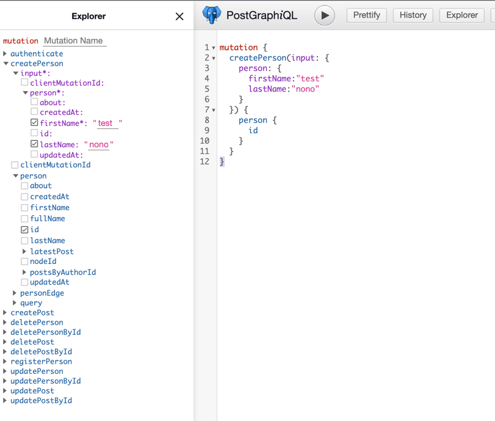

# 2022/01/19 알게 된 것

---

[postgraphile](https://www.graphile.org/postgraphile/introduction/) 이란

postgresql database 만으로 graphql api 서버를 즉시 사용할수 있게 해주는 도구이다.

실무의 기능을 완벽하게 대체하는건 아니지만 스키마 설계후 빠르게 간단한 crud api 확인용으로 사용하면 도움이 되지 않을까 해서 실습을 해보고 있다.

가이드 내용대로 진행을 하니

graphql api 서버를 자동으로 올려주며 api 도 만들어준다.  

더 확인이 필요하다.
